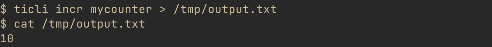

# RFC: TiKV cli in rust

By *go.unwrap()* 团队

| [](https://github.com/wfxr) | [](https://github.com/xuyuanp) | [](https://github.com/Bowser1704) |
| :---:                                                                                     | :---:                                                                                          | :---:                                                                                                 |
| [wfxr](https://github.com/wfxr)                                                           | [Xuyuanp](https://github.com/xuyuanp)                                                          | [Bowser1704](https://github.com/Bowser1704)                                                           |

## 项目介绍

用 rust 为 TiKV 实现一个 modern cli。

## 背景&动机

CLI 对数据库管理人员和开发者来说都是非常重要的工具，它可以方便用户编写脚本和排查问题，也能帮助用户快速上手试用产品。
我们熟知的 MySQL, PostgreSQL, Redis 等数据库都有很好用的 CLI，
但目前 TiKV 官方并没有类似定位的工具，READEME 中只有 SDK 代码调用的示例，
所以我们觉得为 TiKV 实现一个好用的 CLI 应该是一个很有意义的事情。

Github 上目前有 2 个相关的项目：
[shafreeck/tikv-cli](https://github.com/shafreeck/tikv-cli) 和 [c4pt0r/tcli](https://github.com/c4pt0r/tcli)。
tikv-cli 功能比较简陋，已经不再维护；tcli 是 [dongxu](https://github.com/c4pt0r) 用 go 实现的，功能比较完备，
也在持续维护当中，不过使用体验上和 [mycli](https://github.com/dbcli/mycli) 等优秀的 cli 还有一定的差距。
考虑到 TiKV 本身的 rust 属性，以及 rust 在 CLI 开发中的绝佳体验，TiKV 的 CLI 没有理由不用 rust 来实现。所以我们计划
以 tcli 和 redis-cli 为蓝本，打造一款更好用 的 TiKV CLI，朝着 `ultimate CLI tool for TiKV` 的目标更进一步。

## 项目设计

为 TiKV 提供一个由 rust 编写的命令行工具 `ticli`。用户可以通过 `cargo` 来安装：

```sh
cargo install ticli
```

或者使用其他系统包管理器：

```sh
# Archlinux
pacman -S ticli

# Debian / Ubuntu
apt install ticli

# Rocky Linux / Fedora
dnf install ticli

# macOS
brew install ticli
```

### Command line usage

用户可以使用 `ticli` 执行基础的增删改查的命令：

- `ticli GET <key>`
- `ticli SET <key> <val>`
- `ticli DEL <key>`
- `ticli SCAN <prefix>`
- `ticli INCR <key>`
- `ticli DESC <key>`
- `ticli STRLEN <key>`
- `ticli LOAD <csv>`

举个例子：


`ticli` 只会在检测到 `stdout` 是 `tty` 的时候展示这些额外的类型信息：



为了方便脚本编写，`ticli` 支持通过管道顺序执行预先定义好的命令序列：


对于 `SCAN` 命令，`ticli` 提供可读性更好的 `ascii` 表格来展示输出，
并且能正确排版 CJK 字符和 emoji 字符：


除了 ascii 表格，`ticli` 也支持 `csv` 等其他格式的导出：


### Interactive mode

用命令方式运行 `ticli` 对脚本编写和测试来说非常有用，不过更多的时候我们会用到交互模式。
交互模式会启动一个用于 REPL 的 shell，同样可以执行上面介绍的所有命令：

```sh
$ ticli
TiKV txn@http://127.0.0.1:2379> PING
PONG
```

`ticli` 支持使用 TAB 键按命令名称前缀进行补全：

```sh
TiKV txn@http://127.0.0.1:2379> SC<TAB>
TiKV txn@http://127.0.0.1:2379> SCAN
```

同时也提供 fish 风格的历史命令补全：


历史命令默认持久化到 `HOME` 目录下的 `ticli_history` 文件中，也可以通过 `TICLI_HISTFILE` 环境变量指定其他路径。
